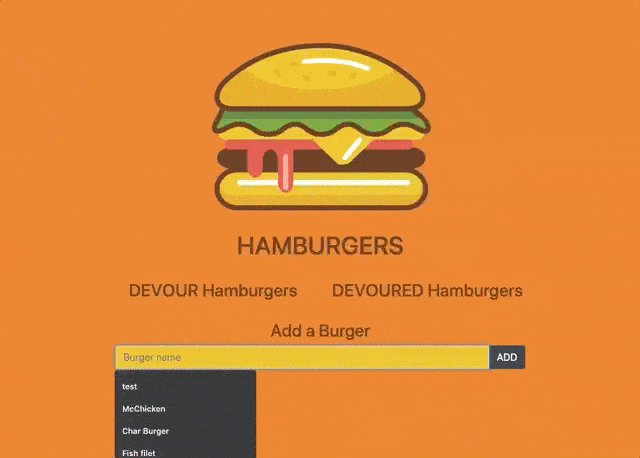

# Homework 13: Burger

This application will log the burgers you will and the the burgers you have eaten so you can always remember those great burgers.

## Click [Here](https://kingsleyramos-burger.herokuapp.com/) for deployed application.
---

## Tool & Resources
---
* [Bootstrap](https://getbootstrap.com/) - CSS framework used
* [JQuery](https://getbootstrap.com/) - JavaScript library used
* [Heroku](https://www.heroku.com/) - Used to deploy the application and the MySQL database
    ### Dependencies
    ---
    * [Express](https://expressjs.com/) - Node Framework used
    * [Handlebars](https://handlebarsjs.com/) - Templating Engine used
    * [mysql](https://www.npmjs.com/package/mysql) - Used to connect to the MySQL database and perform queries

## Assignment Challenges

### AJAX calls and callbacks

An issue was was having was the AJAX promises were not being activated. After some research, I realized that it would not proceed if there is nothing returned. I realized that I would need to return some value and used callbacks to return a status. This will then at least proceed with the promise.

### Understanding the importance of MVC and seeing it in action

This project made me see the importance of MVC as a whole and every little detail. I understood what each file and folder was used for, the purpose of each one, and saw it in action. This is the first i've built a full stack application.